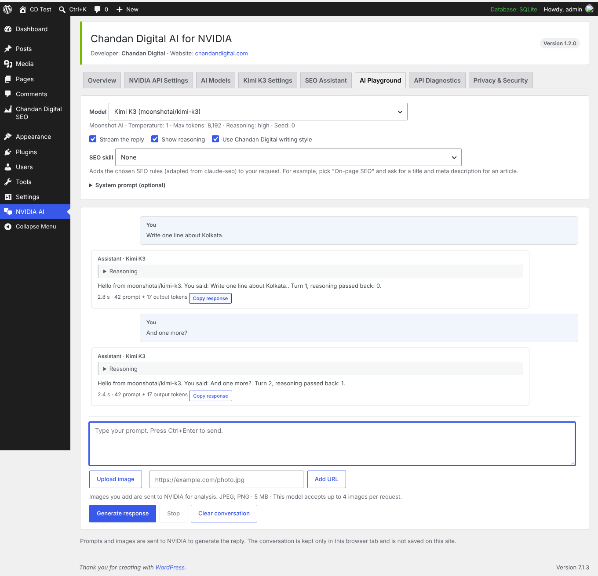
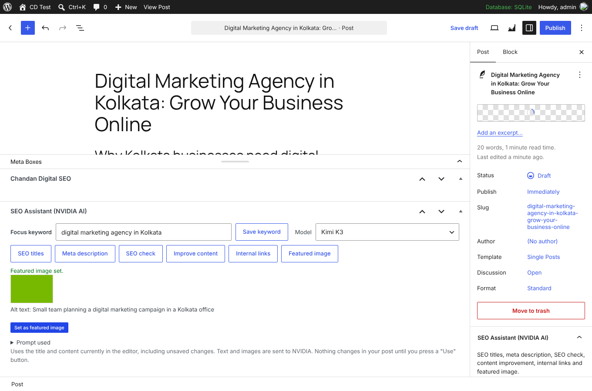

# Chandan Digital AI for NVIDIA

Private WordPress plugin by [Chandan Digital](https://chandandigital.com/) that connects WordPress to NVIDIA-hosted AI models, including **Moonshot AI Kimi K3** (`moonshotai/kimi-k3`), GLM-5.3, GLM-5.3 Flash and DeepSeek V4.1 Flash, plus an **SEO Assistant** in the post and page editor.

Version 1.2.0 · Requires WordPress 6.9+ (7.0+ recommended) and PHP 7.4+ · GPL-2.0-or-later · Manual updates only

## Deliverables

| # | Deliverable | Location |
|---|---|---|
| 1 | Installable plugin ZIP | [`dist/chandan-digital-ai-for-nvidia-v1.2.0.zip`](../../dist/chandan-digital-ai-for-nvidia-v1.2.0.zip) |
| 2 | Complete source code | [`chandan-digital-ai-for-nvidia/`](../../chandan-digital-ai-for-nvidia/) |
| 3 | API integration report | [api-integration-report.md](api-integration-report.md) |
| 4 | Security and privacy audit | [security-privacy-audit.md](security-privacy-audit.md) |
| 5 | Installation guide | [installation-guide.md](installation-guide.md) |
| 6 | API configuration guide | [api-configuration-guide.md](api-configuration-guide.md) |
| 7 | Testing report | [testing-report.md](testing-report.md) |
| | Test harness and raw results | [`tests/chandan-digital-ai-for-nvidia/`](../../tests/chandan-digital-ai-for-nvidia/) |

ZIP SHA-256: `bbad5c4dfbd0d1fbeaf0ae83e19d722dbd816e40475b01946e2474c4f1db8ad7`

## Dashboard

Admin menu **NVIDIA AI** with eight tabs: Overview, NVIDIA API Settings, AI Models, Kimi K3 Settings, SEO Assistant, AI Playground, API Diagnostics, and Privacy & Security.

More screenshots are in [screenshots/](screenshots/). They were taken on a test site that uses a local mock of the NVIDIA API, so the replies shown are test replies.

## Important notes

- Live tests against NVIDIA's real API were **not** possible in the build environment. Please run the checks in the API Configuration Guide on your site.
- Revoke the API key that was shared earlier in conversation, and create a new one.
- Deactivate the original "AI Provider for NVIDIA" plugin before activating this one.
- **403 in posts and pages:** that error comes from the WordPress AI plugin's Connector Approval. Approve **AI** for **NVIDIA** under **Tools > Connector Approvals**, or turn Connector Approval off under **Settings > AI**. Details in the [API integration report](api-integration-report.md#11-the-403-error-in-posts-and-pages-120).
- The SEO rules are adapted from [claude-seo](https://github.com/AgricIDaniel/claude-seo) by AgriciDaniel (MIT License). See `CREDITS.md` in the plugin.
